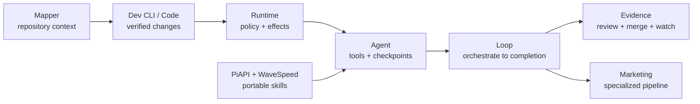

<div align="center">

# Wesley Simplicio

```txt
AI-native software engineer | I use agents to ship more work and keep every change accountable
```

[](https://github.com/wesleysimplicio)
[](https://github.com/wesleysimplicio)
[](https://github.com/wesleysimplicio?tab=repositories)
[](https://github.com/wesleysimplicio?tab=repositories)

**English** · [Português](README.pt-BR.md) · [Español](README.es.md) · [日本語](README.ja.md) · [한국어](README.ko.md) · [简体中文](README.zh-CN.md) · [Italiano](README.it.md) · [Français](README.fr.md) · [Русский](README.ru.md) · [Polski](README.pl.md) · [हिन्दी](README.hi.md) · [العربية](README.ar.md) · [עברית](README.he.md) · [Bahasa Melayu](README.ms.md) · [Bahasa Indonesia](README.id.md)

</div>

---

## `how_i_work`

<div align="center">

### I use AI to ship more code without lowering the bar

My aim is blunt: become the best AI-native developer in the world. I do not expect anyone to believe that because I put it in a README. The commits, tests, reviews, and merged PRs have to make the case.

Generating code is the easy part. The useful part is moving several pieces of work through tests, review, and into `main` without losing track of what changed.

`task intake → scoped execution → commit → test matrix → adversarial review → evidence → PR → conflict resolution → verified merge`


</div>

I split the queue into focused tasks and give each one its own execution slot. One agent can implement while another checks the diff, runs the relevant tests, or tries to break the result. Every change still needs a clear scope, reviewable commit, test evidence, a PR, and confirmation that the merge really reached the remote branch.

That is the advantage I am building: the pace of a much larger engineering team, with the care I would expect from a strong senior developer.

---

## `command_center` · [simplicio-loop](https://github.com/wesleysimplicio/simplicio-loop)

<div align="center">

<a href="https://github.com/wesleysimplicio/simplicio-loop">
  
</a>

[](https://github.com/wesleysimplicio/simplicio-loop/releases)
[](https://github.com/wesleysimplicio/simplicio-loop/stargazers)
[](https://github.com/wesleysimplicio/simplicio-loop/blob/main/LICENSE)

### An agent that stays until the work is actually done

Most coding agents hand back a patch and stop. I built Simplicio Loop to keep the work moving until the tests pass, the review is clean, and the change is merged.

`discover → plan → implement → test → verify → review → merge → close → watch 24/7`

It works with any LLM or runtime. The loop keeps receipts, controls risky actions, watches cost, and continues from the last verified state instead of starting over.

</div>

### `results_signal`

<div align="center">


</div>

> These are published project-level maximums, not a promise that every workload will hit the same number. I also kept the original comparison: **Caveman 65%**, **RTK 80%**, and Simplicio at **up to 96%**.

<div align="center">

<a href="https://github.com/wesleysimplicio/simplicio-loop">
  
</a>

</div>

---

## `ecosystem_control_room`

I built these projects because the same problems kept coming back: agents losing context, tools editing the wrong thing, tasks stopping before review, and results with no proof behind them.

### Orchestration and agency

<table>
<tr>
<td width="50%" valign="top">
  <a href="https://github.com/wesleysimplicio/simplicio-agent">
    
  </a>
  <h3><a href="https://github.com/wesleysimplicio/simplicio-agent">simplicio-agent</a> · v2026.7.20</h3>
  <p><strong>Problem:</strong> autonomous agents can act without durable checkpoints or a trustworthy audit trail.</p>
  <p><strong>What I built:</strong> gated actions, checkpoints, evidence receipts, MCP, skills, multi-model freedom, and Rust-backed deterministic boundaries.</p>
</td>
<td width="50%" valign="top">
  <a href="https://github.com/wesleysimplicio/simplicio">
    
  </a>
  <h3><a href="https://github.com/wesleysimplicio/simplicio">simplicio</a> · v3.5.2</h3>
  <p><strong>Problem:</strong> AI coding tools waste context and fragment chat, mapping, editing, and multi-agent work.</p>
  <p><strong>What I built:</strong> one coding-agent runtime and distribution surface, preserving the published <strong>up to 96% token-savings</strong> result.</p>
</td>
</tr>
</table>

<table>
<tr>
<td width="50%" valign="top">
  <h3>Simplicio Runtime · private core</h3>
  <p><strong>Problem:</strong> every agent product otherwise rebuilds model routing, execution policy, evidence, receipts, local/cloud inference, and token accounting.</p>
  <p><strong>What I built:</strong> one native operational spine for the full ecosystem. It remains private and is intentionally not presented as a public repository.</p>
  <p><code>models → policy → tools → effects → receipts → evidence</code></p>
</td>
<td width="50%" valign="top">
  <h3><a href="https://github.com/wesleysimplicio/simplicio-code">simplicio-code</a> · Rust</h3>
  <p><strong>Problem:</strong> coding agents drift from the runtime, evidence, and execution boundaries that are supposed to govern them.</p>
  <p><strong>What I built:</strong> a Rust coding agent powered by Simplicio Runtime, connecting implementation decisions to controlled execution.</p>
  <p><code>request → context → patch → runtime → proof</code></p>
</td>
</tr>
</table>

### Coding, context, and proof

<table>
<tr>
<td width="50%" valign="top">
  <a href="https://github.com/wesleysimplicio/simplicio-dev-cli">
    
  </a>
  <h3><a href="https://github.com/wesleysimplicio/simplicio-dev-cli">simplicio-dev-cli</a> · v0.16.1</h3>
  <p><strong>Problem:</strong> a one-line coding request is not a delivery process.</p>
  <p><strong>What I built:</strong> mapped context, deterministic edits, tests, retries, reviewable diffs, and evidence. The project is positioned around <strong>99% accuracy</strong> across major LLM hosts.</p>
</td>
<td width="50%" valign="top">
  <a href="https://github.com/wesleysimplicio/simplicio-mapper">
    
  </a>
  <h3><a href="https://github.com/wesleysimplicio/simplicio-mapper">simplicio-mapper</a> · v0.23.1</h3>
  <p><strong>Problem:</strong> agents begin coding blind when repository structure, dependencies, symbols, and precedent are missing.</p>
  <p><strong>What I built:</strong> a stack-neutral project map and compressed context pack available from minute one.</p>
</td>
</tr>
</table>

<table>
<tr>
<td width="50%" valign="top">
  <a href="https://github.com/wesleysimplicio/simplicio-prompt">
    
  </a>
  <h3><a href="https://github.com/wesleysimplicio/simplicio-prompt">simplicio-prompt</a> · v1.14.1</h3>
  <p><strong>Problem:</strong> large agent systems waste context searching for capabilities and memory.</p>
  <p><strong>What I built:</strong> yool + tuple-space + HAMT addressing, guardrails, receipts, and a published <strong>75% token-economy</strong> position.</p>
</td>
<td width="50%" valign="top">
  <a href="https://github.com/wesleysimplicio/simplicio-sprint">
    
  </a>
  <h3><a href="https://github.com/wesleysimplicio/simplicio-sprint">simplicio-sprint</a> · v1.2.14</h3>
  <p><strong>Problem:</strong> sprint tickets do not carry repository architecture or delivery proof.</p>
  <p><strong>What I built:</strong> Jira/Azure DevOps intake, repository mapping, multi-agent dispatch, and result verification.</p>
</td>
</tr>
</table>

### Local intelligence and growth systems

<table>
<tr>
<td width="50%" valign="top">
  <a href="https://github.com/wesleysimplicio/simplicio-local">
    
  </a>
  <h3><a href="https://github.com/wesleysimplicio/simplicio-local">simplicio-local</a></h3>
  <p><strong>Problem:</strong> cloud inference adds latency, recurring cost, network dependency, and privacy constraints.</p>
  <p><strong>What I built:</strong> <strong>100% on-device</strong> Apple Silicon inference paths using MLX, Metal, and ANE-oriented architecture.</p>
</td>
<td width="50%" valign="top">
  <a href="https://github.com/wesleysimplicio/simplicio-loop-marketing">
    
  </a>
  <h3><a href="https://github.com/wesleysimplicio/simplicio-loop-marketing">simplicio-loop-marketing</a> · v0.4.0</h3>
  <p><strong>Problem:</strong> marketing teams are locked into one provider and disconnected manual tools.</p>
  <p><strong>What I built:</strong> <code>brief → script → creative → caption → compliance → publish → metrics → ads</code>, with provider routing through configuration.</p>
</td>
</tr>
</table>

<table>
<tr>
<td width="50%" valign="top">
  <a href="https://github.com/wesleysimplicio/PiAPI-Skills">
    
  </a>
  <h3><a href="https://github.com/wesleysimplicio/PiAPI-Skills">PiAPI-Skills</a> · v1.2.0</h3>
  <p><strong>Problem:</strong> media-generation capabilities are fragmented across agent platforms.</p>
  <p><strong>What I built:</strong> one portable skill surface for Claude, Codex, Hermes, OpenClaw, Cursor, Windsurf, and generic agents.</p>
</td>
<td width="50%" valign="top">
  <a href="https://github.com/wesleysimplicio/WaveSpeedAI-Skills">
    
  </a>
  <h3><a href="https://github.com/wesleysimplicio/WaveSpeedAI-Skills">WaveSpeedAI-Skills</a> · v1.2.0</h3>
  <p><strong>Problem:</strong> teams repeatedly rebuild provider integrations for every agent host.</p>
  <p><strong>What I built:</strong> one installer and CLI exposing <strong>700+ models</strong> to agentskills.io-compatible environments.</p>
</td>
</tr>
</table>

---

## `system_flow`



---

## `public_ranking` · refreshed 2026-07-22

Top public repositories by stars, excluding forks and the profile repository. Snapshot values are preserved; badges and graphs below update live.

| Rank | Project | Stars | Forks | What it is known for |
|---:|---|---:|---:|---|
| 1 | [**hermes-turbo-agent**](https://github.com/wesleysimplicio/hermes-turbo-agent) | **17** | **4** | Performance research, benchmarks, low-latency agent paths |
| 2 | [**simplicio-local**](https://github.com/wesleysimplicio/simplicio-local) | **14** | **1** | Apple Silicon on-device inference |
| 3 | [**simplicio-loop**](https://github.com/wesleysimplicio/simplicio-loop) | **12** | **2** | Universal AI work orchestrator · flagship |
| 4 | [**simplicio**](https://github.com/wesleysimplicio/simplicio) | **10** | **0** | Coding-agent runtime and multi-agent execution |
| 5 | [**simplicio-loop-marketing**](https://github.com/wesleysimplicio/simplicio-loop-marketing) | **7** | **1** | Provider-agnostic AI marketing pipeline |
| 6 | [**simplicio-mapper**](https://github.com/wesleysimplicio/simplicio-mapper) | **7** | **0** | Repository mapping and agent context |
| 7 | [**PiAPI-Skills**](https://github.com/wesleysimplicio/PiAPI-Skills) | **6** | **0** | Portable AI media-generation skills |
| 8 | [**simplicio-prompt**](https://github.com/wesleysimplicio/simplicio-prompt) | **6** | **1** | Efficient capability addressing |
| 9 | [**simplicio-agent**](https://github.com/wesleysimplicio/simplicio-agent) | **4** | **0** | Gated autonomous agent runtime |
| 10 | [**simplicio-dev-cli**](https://github.com/wesleysimplicio/simplicio-dev-cli) | **2** | **1** | Verified task-to-diff execution |

---

## `live_operations_dashboard`

<div align="center">


### Star history · current top projects

<a href="https://star-history.com/#wesleysimplicio/hermes-turbo-agent&wesleysimplicio/simplicio-local&wesleysimplicio/simplicio-loop&wesleysimplicio/simplicio&wesleysimplicio/simplicio-loop-marketing&wesleysimplicio/simplicio-mapper&wesleysimplicio/PiAPI-Skills&wesleysimplicio/simplicio-prompt&wesleysimplicio/simplicio-agent&wesleysimplicio/simplicio-dev-cli&Date">
  
</a>

### Contribution activity


</div>

> Ranking refreshed from the public GitHub API on 2026-07-22. Live cards and badges may move after the snapshot. Clone counts and release-download counts are not embedded because GitHub's Traffic API requires authenticated access.

---

## `open_source_lab`

<a href="https://github.com/NousResearch/hermes-agent">
  
</a>

### What I changed upstream

[](https://github.com/NousResearch/hermes-agent/commits/main/?author=wesleysimplicio)

GitHub records **38 commit contributions** from me to the original Hermes Agent in 2026 through July 22. The work landed in parts of the product people actually touch:

- Fixed dashboard and terminal details that got in the way, including provider search, mobile scrolling, and selection/copy behavior.
- Made Hermes less fragile in Docker by improving gateway detection, environment propagation, cleanup of orphaned processes, and recovery from temporary failures.
- Added compatibility fixes for fallback API keys, DeepSeek V4 thinking blocks, provider profiles, browser detection, and IMAP.
- Tightened Kanban migrations and dependency handling, CJK session search, checkpoints, and optional dependency packaging.

- [**hermes-turbo-agent**](https://github.com/wesleysimplicio/hermes-turbo-agent): performance branch with benchmarks, visual comparisons, token reporting, and safe hot-path research.
- [**x-bookmarks-panel**](https://github.com/wesleysimplicio/x-bookmarks-panel): turns saved X posts into an actionable local-first AI queue.
- [**x-virality-skills**](https://github.com/wesleysimplicio/x-virality-skills): source-grounded workflows for X's For You algorithm.
- [**sistema-sindico**](https://github.com/wesleysimplicio/sistema-sindico): PHP/MySQL condominium management with a mobile-ready API foundation.
- [**Brazil banking CLI suite**](https://github.com/wesleysimplicio?tab=repositories&q=brazil-bank): Open Finance and banking experiments across BB, BTG, Inter, Matera, PagBank, PicPay, and Open Finance BR.

---

## `mission`

I like AI when it survives contact with a real repository. It should understand the codebase, remember why a decision was made, coordinate work safely, and leave enough evidence for someone else to trust the result.

I am building the tooling I wanted for my own work: less context lost between sessions, less repetition, and more changes that make it all the way from an issue to a verified merge.

## `mentor_acknowledgement`

[Jesse Daniel Brown, PhD](https://github.com/JesseBrown1980) has been an important mentor to me. He is from California and has written more than 100 scientific articles. His view of programming and AI is grounded in education and humanitarian work, and it has shaped how I think about building technology that is useful to people.

## `connect`

- GitHub: [@wesleysimplicio](https://github.com/wesleysimplicio)
- X: [@wesleysimplic](https://x.com/wesleysimplic)
- Instagram: [@wesleysimplicio](https://instagram.com/wesleysimplicio)
- LinkedIn: [wesleysimplicio](https://br.linkedin.com/in/wesleysimplicio)
- YouTube: [@wesleysimplicio](https://www.youtube.com/@wesleysimplicio)

<div align="center">

### `I build AI systems that finish the job`

</div>
