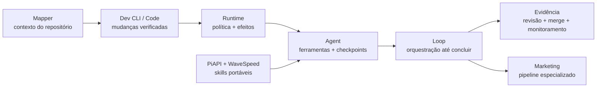

<div align="center">

# Wesley Simplicio

```txt
construtor de sistemas de IA | orquestração de agentes | runtimes local-first | execução verificada
```

[](https://github.com/wesleysimplicio)
[](https://github.com/wesleysimplicio)
[](https://github.com/wesleysimplicio?tab=repositories)
[](https://github.com/wesleysimplicio?tab=repositories)

[English](README.md) · **Português** · [Español](README.es.md) · [日本語](README.ja.md) · [한국어](README.ko.md) · [简体中文](README.zh-CN.md) · [Italiano](README.it.md) · [Français](README.fr.md) · [Русский](README.ru.md) · [Polski](README.pl.md) · [हिन्दी](README.hi.md) · [العربية](README.ar.md) · [עברית](README.he.md) · [Bahasa Melayu](README.ms.md) · [Bahasa Indonesia](README.id.md)

</div>

---

## `central_de_comando` · [simplicio-loop](https://github.com/wesleysimplicio/simplicio-loop)

<div align="center">

<a href="https://github.com/wesleysimplicio/simplicio-loop">
  
</a>

[](https://github.com/wesleysimplicio/simplicio-loop/releases)
[](https://github.com/wesleysimplicio/simplicio-loop/stargazers)
[](https://github.com/wesleysimplicio/simplicio-loop/blob/main/LICENSE)

### O Orquestrador Universal de Loops de IA

A maioria dos agentes para em uma resposta, um plano ou um patch sem verificação. O Simplicio Loop assume todo o ciclo de entrega:

`descobrir → planejar → implementar → testar → verificar → revisar → mergear → fechar → acompanhar 24/7`

Qualquer LLM. Qualquer runtime. Gates de segurança, evidências, controle de custo e continuação determinística até o trabalho estar realmente entregue.

</div>

### `sinal_de_resultados`

<div align="center">


</div>

> Os números permanecem visíveis porque representam resultados e posicionamentos publicados pelos projetos. São máximos ou números de projeto, não promessa de que todo workload atingirá o teto. As comparações originais também foram preservadas: **Caveman 65%** e **RTK 80%** contra os **até 96%** publicados pelo Simplicio.

<div align="center">

<a href="https://github.com/wesleysimplicio/simplicio-loop">
  
</a>

</div>

---

## `sala_de_controle_do_ecossistema`

Cada projeto tem uma função: remover uma fonte específica de falha entre uma ideia e um resultado verificado.

### Orquestração e agência

<table>
<tr>
<td width="50%" valign="top">
  <a href="https://github.com/wesleysimplicio/simplicio-agent">
    
  </a>
  <h3><a href="https://github.com/wesleysimplicio/simplicio-agent">simplicio-agent</a> · v2026.7.20</h3>
  <p><strong>Problema:</strong> agentes autônomos podem agir sem checkpoints duráveis ou trilha de auditoria confiável.</p>
  <p><strong>Resolve com:</strong> ações controladas, checkpoints, recibos de evidência, MCP, skills, liberdade entre modelos e fronteiras determinísticas apoiadas por Rust.</p>
</td>
<td width="50%" valign="top">
  <a href="https://github.com/wesleysimplicio/simplicio">
    
  </a>
  <h3><a href="https://github.com/wesleysimplicio/simplicio">simplicio</a> · v3.5.2</h3>
  <p><strong>Problema:</strong> ferramentas de código com IA desperdiçam contexto e fragmentam chat, mapeamento, edição e trabalho multiagente.</p>
  <p><strong>Resolve com:</strong> um runtime e uma distribuição unificada para coding agents, preservando o resultado publicado de <strong>até 96% de economia de tokens</strong>.</p>
</td>
</tr>
</table>

<table>
<tr>
<td width="50%" valign="top">
  <h3>Simplicio Runtime · core privado</h3>
  <p><strong>Problema:</strong> cada produto de agente teria que reconstruir roteamento de modelos, políticas, evidências, recibos, inferência local/cloud e contabilidade de tokens.</p>
  <p><strong>Resolve com:</strong> uma espinha operacional nativa para todo o ecossistema. Continua privado e não é apresentado como repositório público.</p>
  <p><code>modelos → política → ferramentas → efeitos → recibos → evidência</code></p>
</td>
<td width="50%" valign="top">
  <h3><a href="https://github.com/wesleysimplicio/simplicio-code">simplicio-code</a> · Rust</h3>
  <p><strong>Problema:</strong> agentes de código se afastam do runtime, das evidências e das fronteiras de execução que deveriam governá-los.</p>
  <p><strong>Resolve com:</strong> um coding agent em Rust ligado ao Simplicio Runtime, conectando decisões de implementação à execução controlada.</p>
  <p><code>pedido → contexto → patch → runtime → prova</code></p>
</td>
</tr>
</table>

### Código, contexto e prova

<table>
<tr>
<td width="50%" valign="top">
  <a href="https://github.com/wesleysimplicio/simplicio-dev-cli">
    
  </a>
  <h3><a href="https://github.com/wesleysimplicio/simplicio-dev-cli">simplicio-dev-cli</a> · v0.16.1</h3>
  <p><strong>Problema:</strong> um pedido de código em uma linha não é um processo de entrega.</p>
  <p><strong>Resolve com:</strong> contexto mapeado, edições determinísticas, testes, retries, diffs revisáveis e evidências — com posicionamento de <strong>99% de precisão</strong> nos principais hosts de LLM.</p>
</td>
<td width="50%" valign="top">
  <a href="https://github.com/wesleysimplicio/simplicio-mapper">
    
  </a>
  <h3><a href="https://github.com/wesleysimplicio/simplicio-mapper">simplicio-mapper</a> · v0.23.1</h3>
  <p><strong>Problema:</strong> agentes começam a programar no escuro sem estrutura, dependências, símbolos e precedentes do repositório.</p>
  <p><strong>Resolve com:</strong> mapa stack-neutral e pacote de contexto comprimido disponível desde o primeiro minuto.</p>
</td>
</tr>
</table>

<table>
<tr>
<td width="50%" valign="top">
  <a href="https://github.com/wesleysimplicio/simplicio-prompt">
    
  </a>
  <h3><a href="https://github.com/wesleysimplicio/simplicio-prompt">simplicio-prompt</a> · v1.14.1</h3>
  <p><strong>Problema:</strong> sistemas grandes de agentes desperdiçam contexto procurando capacidades e memória.</p>
  <p><strong>Resolve com:</strong> endereçamento yool + tuple-space + HAMT, guardrails, recibos e posicionamento publicado de <strong>75% de economia de tokens</strong>.</p>
</td>
<td width="50%" valign="top">
  <a href="https://github.com/wesleysimplicio/simplicio-sprint">
    
  </a>
  <h3><a href="https://github.com/wesleysimplicio/simplicio-sprint">simplicio-sprint</a> · v1.2.14</h3>
  <p><strong>Problema:</strong> tickets de sprint não carregam arquitetura do repo nem prova de entrega.</p>
  <p><strong>Resolve com:</strong> intake de Jira/Azure DevOps, mapeamento do repositório, despacho multiagente e verificação do resultado.</p>
</td>
</tr>
</table>

### Inteligência local e sistemas de crescimento

<table>
<tr>
<td width="50%" valign="top">
  <a href="https://github.com/wesleysimplicio/simplicio-local">
    
  </a>
  <h3><a href="https://github.com/wesleysimplicio/simplicio-local">simplicio-local</a></h3>
  <p><strong>Problema:</strong> inferência cloud adiciona latência, custo recorrente, dependência de rede e restrições de privacidade.</p>
  <p><strong>Resolve com:</strong> caminhos de inferência <strong>100% no dispositivo</strong> em Apple Silicon usando MLX, Metal e arquitetura orientada a ANE.</p>
</td>
<td width="50%" valign="top">
  <a href="https://github.com/wesleysimplicio/simplicio-loop-marketing">
    
  </a>
  <h3><a href="https://github.com/wesleysimplicio/simplicio-loop-marketing">simplicio-loop-marketing</a> · v0.4.0</h3>
  <p><strong>Problema:</strong> times de marketing ficam presos a um provedor e a ferramentas manuais desconectadas.</p>
  <p><strong>Resolve com:</strong> <code>briefing → roteiro → criativo → legenda → compliance → publicação → métricas → anúncios</code>, com roteamento de provedores por configuração.</p>
</td>
</tr>
</table>

<table>
<tr>
<td width="50%" valign="top">
  <a href="https://github.com/wesleysimplicio/PiAPI-Skills">
    
  </a>
  <h3><a href="https://github.com/wesleysimplicio/PiAPI-Skills">PiAPI-Skills</a> · v1.2.0</h3>
  <p><strong>Problema:</strong> capacidades de geração de mídia ficam fragmentadas entre plataformas de agentes.</p>
  <p><strong>Resolve com:</strong> uma superfície portável de skills para Claude, Codex, Hermes, OpenClaw, Cursor, Windsurf e agentes genéricos.</p>
</td>
<td width="50%" valign="top">
  <a href="https://github.com/wesleysimplicio/WaveSpeedAI-Skills">
    
  </a>
  <h3><a href="https://github.com/wesleysimplicio/WaveSpeedAI-Skills">WaveSpeedAI-Skills</a> · v1.2.0</h3>
  <p><strong>Problema:</strong> equipes reconstroem integrações de provedores para cada host de agentes.</p>
  <p><strong>Resolve com:</strong> um instalador e uma CLI que expõem <strong>700+ modelos</strong> para ambientes compatíveis com agentskills.io.</p>
</td>
</tr>
</table>

---

## `fluxo_do_sistema`



---

## `ranking_publico` · atualizado em 2026-07-22

Principais repositórios públicos por estrelas, excluindo forks e o repositório de perfil. Os valores do snapshot ficam preservados; badges e gráficos atualizam ao vivo.

| Posição | Projeto | Estrelas | Forks | Destaque |
|---:|---|---:|---:|---|
| 1 | [**hermes-turbo-agent**](https://github.com/wesleysimplicio/hermes-turbo-agent) | **17** | **4** | Pesquisa de performance, benchmarks e baixa latência |
| 2 | [**simplicio-local**](https://github.com/wesleysimplicio/simplicio-local) | **14** | **1** | Inferência local em Apple Silicon |
| 3 | [**simplicio-loop**](https://github.com/wesleysimplicio/simplicio-loop) | **12** | **2** | Orquestrador universal de trabalho com IA · flagship |
| 4 | [**simplicio**](https://github.com/wesleysimplicio/simplicio) | **10** | **0** | Runtime de coding agent e execução multiagente |
| 5 | [**simplicio-loop-marketing**](https://github.com/wesleysimplicio/simplicio-loop-marketing) | **7** | **1** | Pipeline de marketing independente de provedor |
| 6 | [**simplicio-mapper**](https://github.com/wesleysimplicio/simplicio-mapper) | **7** | **0** | Mapeamento de repositório e contexto para agentes |
| 7 | [**PiAPI-Skills**](https://github.com/wesleysimplicio/PiAPI-Skills) | **6** | **0** | Skills portáveis de geração de mídia |
| 8 | [**simplicio-prompt**](https://github.com/wesleysimplicio/simplicio-prompt) | **6** | **1** | Endereçamento eficiente de capacidades |
| 9 | [**simplicio-agent**](https://github.com/wesleysimplicio/simplicio-agent) | **4** | **0** | Runtime controlado de agente autônomo |
| 10 | [**simplicio-dev-cli**](https://github.com/wesleysimplicio/simplicio-dev-cli) | **2** | **1** | Execução verificada de tarefa até diff |

---

## `painel_de_operacoes_ao_vivo`

<div align="center">


### Histórico de estrelas · projetos atuais

<a href="https://star-history.com/#wesleysimplicio/hermes-turbo-agent&wesleysimplicio/simplicio-local&wesleysimplicio/simplicio-loop&wesleysimplicio/simplicio&wesleysimplicio/simplicio-loop-marketing&wesleysimplicio/simplicio-mapper&wesleysimplicio/PiAPI-Skills&wesleysimplicio/simplicio-prompt&wesleysimplicio/simplicio-agent&wesleysimplicio/simplicio-dev-cli&Date">
  
</a>

### Atividade de contribuição


</div>

> Ranking atualizado pela API pública do GitHub em 2026-07-22. Cards e badges vivos podem mudar depois do snapshot. Contagens de clones e downloads de releases não são incorporadas porque a Traffic API exige autenticação.

---

## `laboratorio_open_source`

<a href="https://github.com/NousResearch/hermes-agent">
  
</a>

### Impacto das contribuições upstream

[](https://github.com/NousResearch/hermes-agent/commits/main/?author=wesleysimplicio)

**38 contribuições de commit para o Hermes Agent original em 2026, até 22 de julho.** Essas mudanças melhoraram o projeto em quatro frentes práticas:

- **Experiência do agente e dashboard** — manteve os modelos do provider selecionado visíveis durante buscas, habilitou rolagem no dashboard mobile e tornou seleção/cópia no terminal mais previsível.
- **Resiliência do runtime e containers** — fortaleceu detecção do gateway no Docker, propagação de ambiente para terminal e áudio, degradação sem adapters, limpeza de processos órfãos e recuperação de erros transitórios.
- **Compatibilidade de modelos e integrações** — melhorou fallback de chaves de API, extração de thinking do DeepSeek V4, normalização de providers/perfis, autodetecção do browser e compatibilidade IMAP.
- **Correção dos workflows** — reforçou selects e migrações do Kanban, recomputação de dependências prontas, busca de sessões com tokens CJK curtos, checkpoints e empacotamento de dependências opcionais.

- [**hermes-turbo-agent**](https://github.com/wesleysimplicio/hermes-turbo-agent) — branch de performance com benchmarks, comparações visuais, relatório de tokens e pesquisa segura de hot paths.
- [**x-bookmarks-panel**](https://github.com/wesleysimplicio/x-bookmarks-panel) — transforma posts salvos no X em uma fila local de trabalho com IA.
- [**x-virality-skills**](https://github.com/wesleysimplicio/x-virality-skills) — fluxos fundamentados em fontes para o algoritmo For You do X.
- [**sistema-sindico**](https://github.com/wesleysimplicio/sistema-sindico) — gestão condominial PHP/MySQL com base de API pronta para mobile.
- [**Suíte de CLIs bancárias brasileiras**](https://github.com/wesleysimplicio?tab=repositories&q=brazil-bank) — experimentos de Open Finance e bancos: BB, BTG, Inter, Matera, PagBank, PicPay e Open Finance BR.

---

## `missao`

Eu construo sistemas de IA que transformam contexto em execução confiável. O objetivo é criar alavancagem prática para pessoas e equipes: menos perda de contexto, menos trabalho repetitivo, automação mais segura e software capaz de avançar da ideia ao resultado verificado.

Eu me importo com IA que funciona em ambientes reais, não apenas demos — sistemas que mapeiam repositórios, preservam contexto, coordenam agentes, controlam efeitos e provam o que entregaram.

## `reconhecimento_ao_mentor`

Agradecimento especial ao meu mentor [Jesse Daniel Brown, PhD](https://github.com/JesseBrown1980), natural da Califórnia, EUA, e autor de mais de 100 artigos científicos. Sua perspectiva humanitária e educacional sobre programação, IA e trabalho científico ajudou a reforçar minha missão: construir sistemas práticos de IA que ampliem a capacidade humana.

## `conecte_se`

- GitHub: [@wesleysimplicio](https://github.com/wesleysimplicio)
- X: [@wesleysimplic](https://x.com/wesleysimplic)
- Instagram: [@wesleysimplicio](https://instagram.com/wesleysimplicio)
- LinkedIn: [wesleysimplicio](https://br.linkedin.com/in/wesleysimplicio)
- YouTube: [@wesleysimplicio](https://www.youtube.com/@wesleysimplicio)

<div align="center">

### `transformando ideias de IA em sistemas que executam`

</div>
